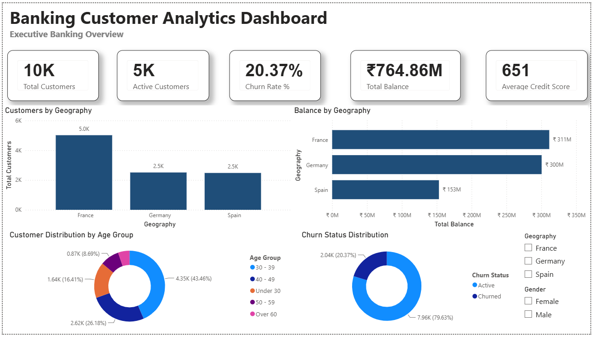
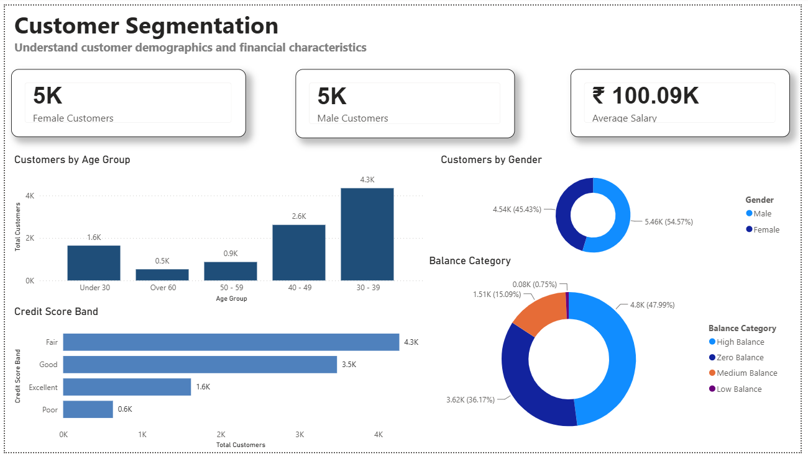
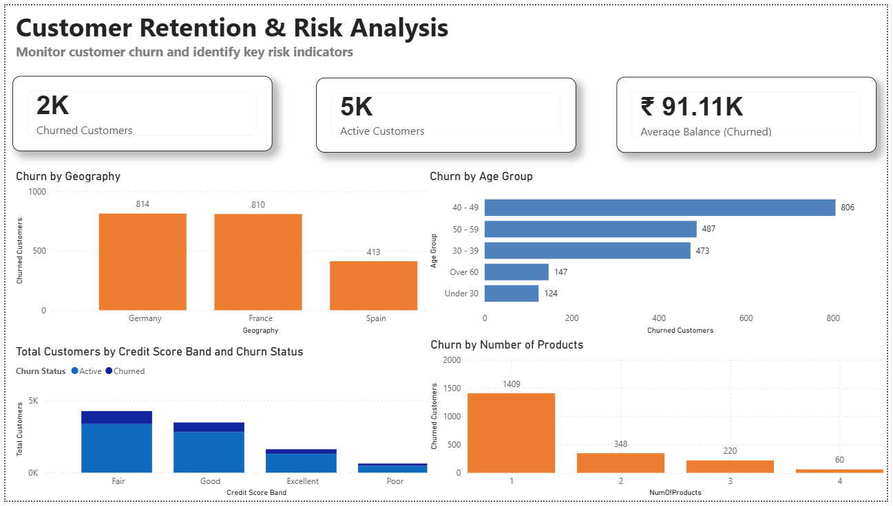

# Banking Customer Analytics Dashboard

An interactive **Power BI dashboard** built to analyze banking customer data and provide insights into customer demographics, financial behavior, and business performance. The dashboard enables stakeholders to monitor key banking KPIs, identify customer segments, and make data-driven decisions through interactive visualizations.

---

## Overview

This project focuses on analyzing banking customer data using Power BI. It transforms raw customer information into meaningful business insights through interactive dashboards, helping stakeholders understand customer profiles, account balances, credit scores, and overall banking performance.

The dashboard is designed for executives and business analysts to explore customer behavior using filters, drill-down capabilities, and KPI visualizations.

---

## Tech Stack

- Power BI Desktop
- DAX
- Power Query
- Data Modeling
- Microsoft Excel / CSV Dataset

---

## Dashboard Pages

### Executive Overview

Provides a high-level summary of the banking dataset through key performance indicators and business metrics.

**Includes:**

- Total Customers
- Total Account Balance
- Average Credit Score
- Average Estimated Salary
- Customer Distribution
- Interactive Filters

---

### Customer Demographics

Analyzes customer characteristics to understand customer distribution across different demographic groups.

**Includes:**

- Gender Distribution
- Age Group Analysis
- Geography Analysis
- Customer Segmentation
- Active vs Inactive Customers

---

### Financial Analysis

Focuses on customer financial behavior and banking performance.

**Includes:**

- Credit Score Distribution
- Account Balance Analysis
- Estimated Salary Analysis
- Product Ownership
- Customer Activity Analysis

---

## Key Features

- Interactive multi-page dashboard
- Executive KPI reporting
- Customer demographic analysis
- Financial performance visualization
- Dynamic filtering and slicing
- Business-friendly visualizations
- Data-driven decision support

---

## Dashboard Preview

### Executive Dashboard



### Customer Demographics



### Financial Analysis



---

## Business Questions Answered

- How many customers are in the dataset?
- What is the average customer credit score?
- Which geographic regions have the highest number of customers?
- How are customers distributed across different age groups?
- What is the relationship between account balance and customer demographics?
- How many customers are active versus inactive?
- Which customer segments contribute the most to overall banking performance?

---

## Project Structure

```text
Banking-Customer-Analytics-Dashboard/
│
├── Dataset/
│   └── Banking Dataset.csv
│
├── Power BI/
│   └── Banking Customer Analytics Dashboard.pbix
│
├── Screenshots/
│   ├── Executive Dashboard.png
│   ├── Customer Demographics.png
│   └── Financial Analysis.png
│
└── README.md
```

---

## Skills Demonstrated

- Dashboard Design
- Power BI Development
- DAX Measures
- Power Query
- Data Cleaning
- Data Modeling
- Customer Analytics
- Banking Analytics
- KPI Reporting
- Business Intelligence

---

## How to Use

1. Clone this repository.
2. Open the `.pbix` file using Power BI Desktop.
3. Refresh the data source if required.
4. Explore the dashboard using the available filters and slicers.

---

## Learning Outcomes

This project demonstrates practical experience in:

- Business Intelligence
- Customer Analytics
- Banking Data Analysis
- Dashboard Development
- Interactive Reporting
- Data Visualization
- Executive KPI Reporting

---

## Author

**Deepak Kumar**

Computer Engineering Graduate

